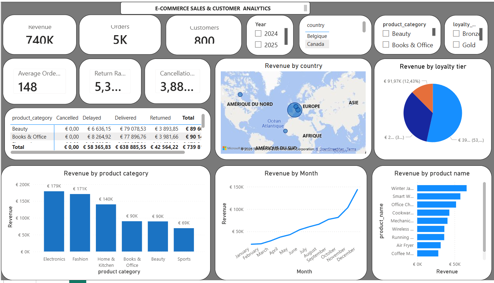
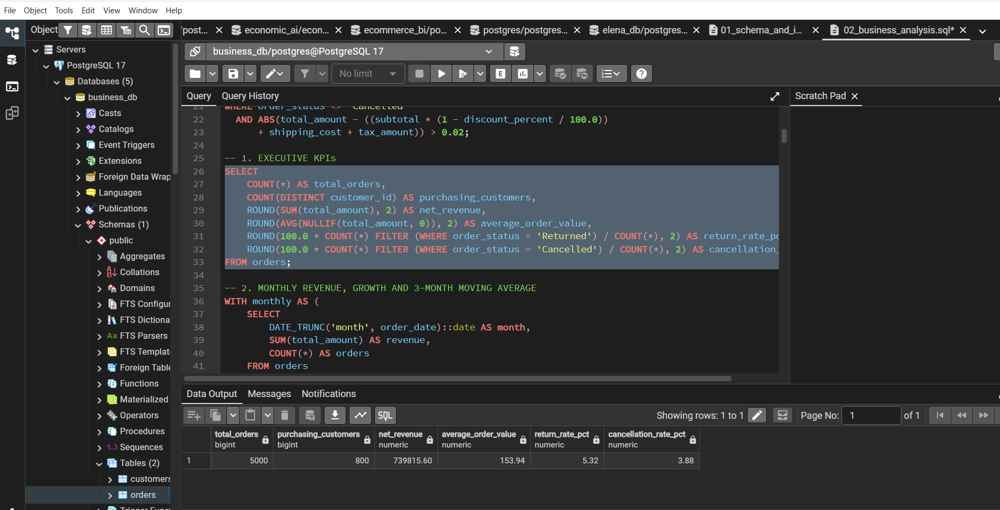
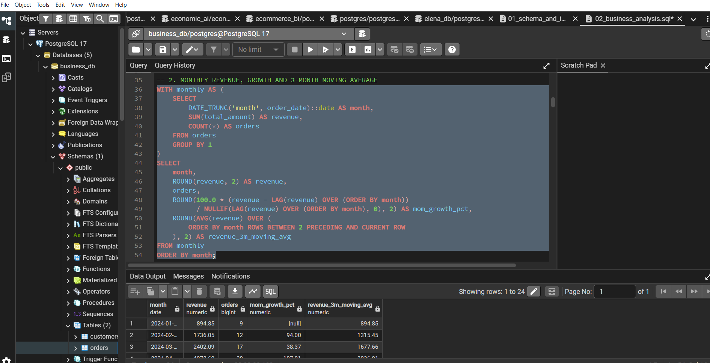
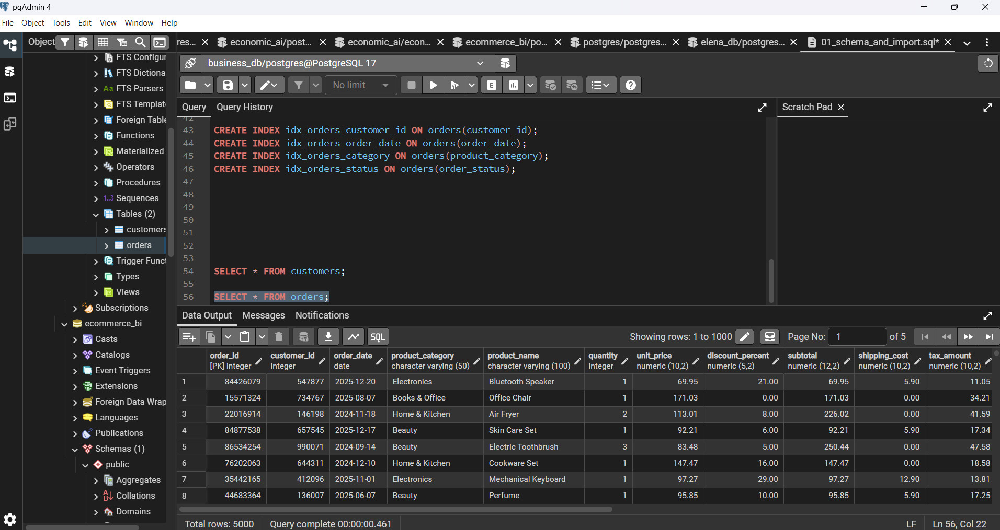

# 🛒 E-Commerce Sales & Customer Analytics

Projet de **Data Analytics / Business Intelligence** basé sur des données e-commerce, réalisé avec **PostgreSQL, SQL et Power BI**.

L'objectif est de transformer des données transactionnelles brutes en **indicateurs métier et tableaux de bord interactifs** permettant d'analyser les ventes, les clients et les performances commerciales.

---

## 📌 Présentation

Le projet repose sur deux jeux de données :

- `customers.csv` : informations sur les clients ;
- `orders.csv` : historique des commandes.

Les données sont intégrées dans **PostgreSQL**, structurées dans un modèle relationnel puis analysées à l'aide de requêtes SQL.

Les résultats sont ensuite exploités dans **Power BI** afin de construire un dashboard interactif destiné au suivi des principaux KPI commerciaux.

---

## 🎯 Objectifs métier

Le projet cherche notamment à répondre aux questions suivantes :

- Quel est le chiffre d'affaires total ?
- Combien de commandes et de clients ont été enregistrés ?
- Quel est le panier moyen ?
- Quels produits et catégories génèrent le plus de revenus ?
- Comment le chiffre d'affaires évolue-t-il dans le temps ?
- Quels pays contribuent le plus aux ventes ?
- Quelle est la performance des différents niveaux de fidélité ?
- Quels sont les taux de retour et d'annulation des commandes ?

---

## 📊 Dashboard Power BI

Le dashboard Power BI permet de suivre les principaux indicateurs de performance et d'explorer les résultats de manière interactive.

### Principaux KPI

- **Chiffre d'affaires : ~740 K€**
- **Commandes : 5 000**
- **Clients : 800**
- **Panier moyen : ~148 €**
- **Taux de retour : 5,32 %**
- **Taux d'annulation : 3,88 %**

Le dashboard présente également :

- le chiffre d'affaires par pays ;
- le chiffre d'affaires par catégorie de produit ;
- le chiffre d'affaires par produit ;
- l'évolution mensuelle du chiffre d'affaires ;
- la répartition du revenu par niveau de fidélité ;
- la performance des catégories selon le statut des commandes.

Des filtres permettent d'affiner l'analyse par **année, pays, catégorie de produit et niveau de fidélité**.

### 🖥️ Aperçu du dashboard



---

## 🗄️ Modèle de données

La base PostgreSQL contient deux tables principales.

### `customers`

Contient les informations relatives aux clients :

- identifiant client ;
- prénom et nom ;
- âge ;
- genre ;
- date d'inscription ;
- niveau de fidélité ;
- ville, région et pays ;
- canal d'acquisition ;
- appareil préféré ;
- consentement marketing.

### `orders`

Contient les transactions commerciales :

- identifiant de commande ;
- identifiant client ;
- date de commande ;
- catégorie et nom du produit ;
- quantité ;
- prix unitaire ;
- remise ;
- sous-total ;
- frais de livraison ;
- taxes ;
- montant total ;
- moyen de paiement ;
- statut de commande ;
- canal de vente ;
- délai de livraison ;
- note client.

La relation principale est :

```text
customers
    │
    │ 1
    │
    └────────── *
               orders
```

La clé `customer_id` permet de relier chaque commande au client correspondant.

---

## 🛠️ Technologies utilisées

| Technologie | Utilisation |
|---|---|
| PostgreSQL | Stockage et gestion des données |
| SQL | Nettoyage, transformation et analyse |
| pgAdmin 4 | Administration et requêtes PostgreSQL |
| Power BI | Modélisation, KPI et visualisation |
| CSV | Sources de données |

---

## 🔍 Analyses SQL

Plusieurs analyses métier ont été réalisées directement dans PostgreSQL.








### KPI exécutifs

```sql
SELECT
    COUNT(*) AS total_orders,
    COUNT(DISTINCT customer_id) AS purchasing_customers,
    ROUND(SUM(total_amount), 2) AS net_revenue,
    ROUND(AVG(NULLIF(total_amount, 0)), 2) AS average_order_value,
    ROUND(
        100.0 * COUNT(*) FILTER (WHERE order_status = 'Returned')
        / COUNT(*), 2
    ) AS return_rate_pct,
    ROUND(
        100.0 * COUNT(*) FILTER (WHERE order_status = 'Cancelled')
        / COUNT(*), 2
    ) AS cancellation_rate_pct
FROM orders;
```

Cette requête permet d'obtenir une vue synthétique de la performance commerciale.

---

## 📈 Analyse de l'évolution mensuelle

L'évolution du chiffre d'affaires est également étudiée dans le temps avec des fonctions analytiques SQL.

```sql
WITH monthly AS (
    SELECT
        DATE_TRUNC('month', order_date)::date AS month,
        SUM(total_amount) AS revenue,
        COUNT(*) AS orders
    FROM orders
    GROUP BY 1
)
SELECT
    month,
    ROUND(revenue, 2) AS revenue,
    orders,
    ROUND(
        100.0 * (revenue - LAG(revenue) OVER (ORDER BY month))
        / NULLIF(LAG(revenue) OVER (ORDER BY month), 0),
        2
    ) AS mom_growth_pct,
    ROUND(
        AVG(revenue) OVER (
            ORDER BY month
            ROWS BETWEEN 2 PRECEDING AND CURRENT ROW
        ),
        2
    ) AS revenue_3m_moving_avg
FROM monthly
ORDER BY month;
```

Cette analyse permet notamment de calculer :

- le chiffre d'affaires mensuel ;
- le nombre de commandes ;
- la croissance **Month-over-Month** ;
- la moyenne mobile du chiffre d'affaires sur 3 mois.

---

## ⚙️ Optimisation PostgreSQL

Des index ont été créés sur les colonnes fréquemment utilisées dans les jointures, filtres et analyses :

```sql
CREATE INDEX idx_orders_customer_id
ON orders(customer_id);

CREATE INDEX idx_orders_order_date
ON orders(order_date);

CREATE INDEX idx_orders_category
ON orders(product_category);

CREATE INDEX idx_orders_status
ON orders(order_status);
```

---

## 📂 Structure du projet

```text
ecommerce_project/
│
├── data/
│   ├── customers.csv
│   └── orders.csv
│
├── sql/
│   ├── 01_schema_and_import.sql
│   └── 02_business_analysis.sql
│
├── assets/
│   └── Report_B.png
│
└── README.md
```

> La structure peut être adaptée selon l'organisation réelle des fichiers du dépôt.

---

## 🚀 Workflow du projet

```text
customers.csv + orders.csv
          │
          ▼
     PostgreSQL
          │
          ▼
 Nettoyage / Modélisation
          │
          ▼
    Analyses SQL
          │
          ▼
 KPI & indicateurs métier
          │
          ▼
       Power BI
          │
          ▼
 Dashboard interactif
```

---

## 💡 Compétences mises en pratique

Ce projet met notamment en pratique :

**Data Analysis**
- analyse exploratoire ;
- définition de KPI ;
- analyse des ventes ;
- analyse client ;
- interprétation métier.

**SQL / PostgreSQL**
- création de tables ;
- clés primaires et étrangères ;
- contraintes ;
- agrégations ;
- CTE ;
- fonctions analytiques ;
- `LAG()` ;
- moyennes mobiles ;
- indexation.

**Business Intelligence**
- connexion PostgreSQL / Power BI ;
- création de KPI ;
- modélisation des données ;
- visualisation ;
- filtres interactifs ;
- conception d'un dashboard orienté décision.

---

## 🎯 Résultat

Ce projet illustre un workflow de **Data Analytics de bout en bout** :

**données brutes → base PostgreSQL → analyses SQL → indicateurs métier → dashboard Power BI.**

Il montre comment transformer des données transactionnelles e-commerce en informations exploitables pour le **suivi des ventes, l'analyse client et l'aide à la décision**.

---

## 👤 Auteur

**Eudes KODIA**

Projet réalisé dans le cadre du développement de compétences en **Data Analytics, SQL, PostgreSQL et Business Intelligence**.
